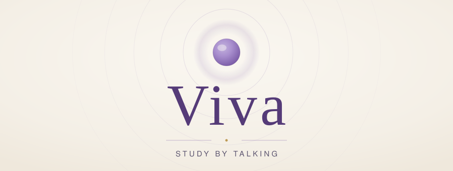
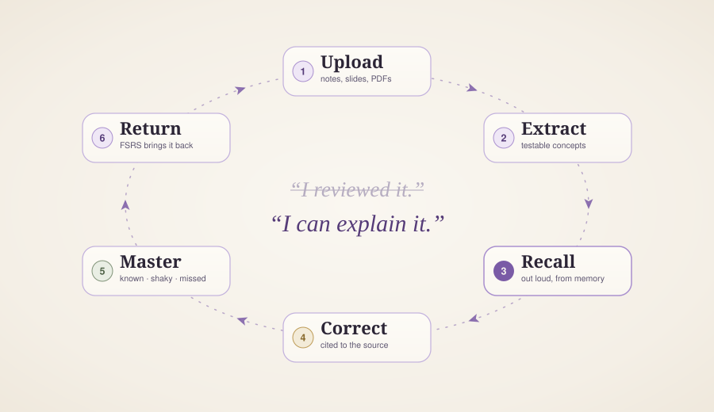
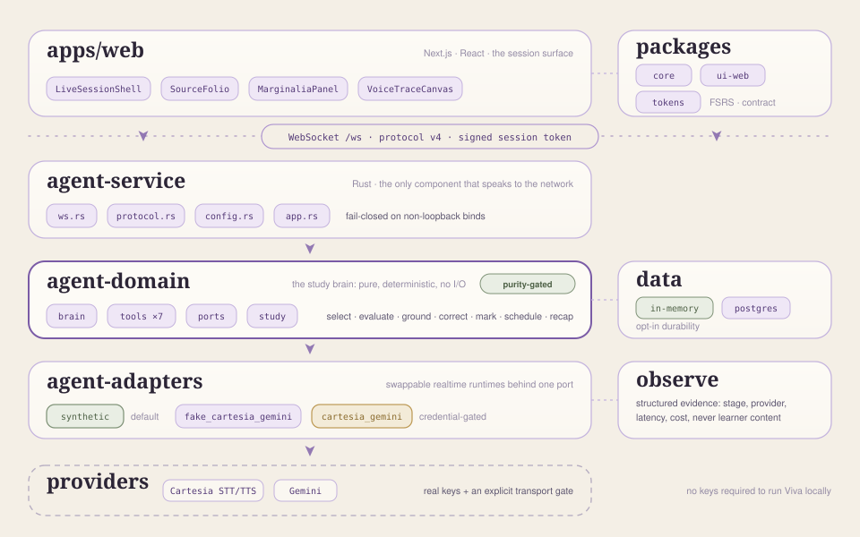
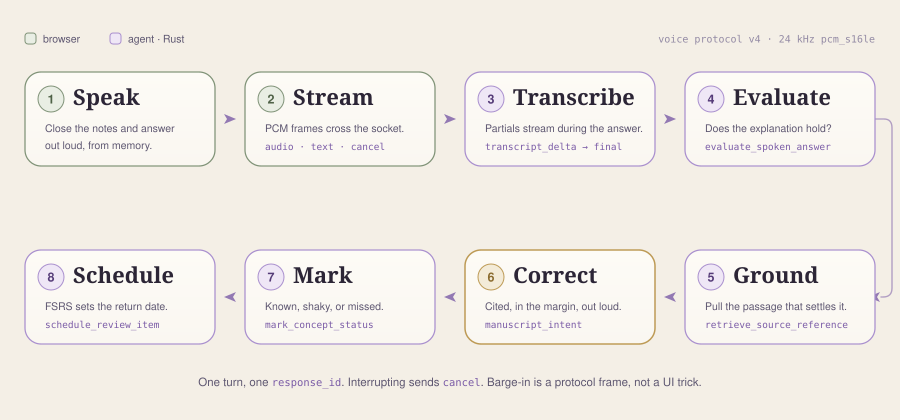

<p align="center">
  <picture>
    <source media="(max-width: 500px)" srcset="docs/assets/hero-mobile.svg" />
    
  </picture>
</p>

<p align="center">
  <a href="LICENSE"></a>
  <a href="https://github.com/backbay-labs/viva/actions/workflows/validate.yml"></a>
  <a href="agent/crates/agent-service/src/protocol.rs"></a>
  
  
  <a href="docs/"></a>
</p>

<p align="center">
  <strong>An oral exam room for the AI era.</strong>
</p>

<p align="center">
  <a href="#what-is-viva">What</a>&nbsp;&nbsp;&middot;&nbsp;&nbsp;
  <a href="#the-loop">The loop</a>&nbsp;&nbsp;&middot;&nbsp;&nbsp;
  <a href="#quickstart">Quickstart</a>&nbsp;&nbsp;&middot;&nbsp;&nbsp;
  <a href="#architecture">Architecture</a>&nbsp;&nbsp;&middot;&nbsp;&nbsp;
  <a href="#study-modes">Modes</a>&nbsp;&nbsp;&middot;&nbsp;&nbsp;
  <a href="#privacy-and-trust">Privacy</a>&nbsp;&nbsp;&middot;&nbsp;&nbsp;
  <a href="#roadmap">Roadmap</a>&nbsp;&nbsp;&middot;&nbsp;&nbsp;
  <a href="CONTRIBUTING.md">Contributing</a>
</p>

---

```sh
git clone https://github.com/backbay-labs/viva.git && cd viva && bun install && bun run dev:agent
```

The whole study loop runs on that command: no API keys, no microphone, no database.

## What is Viva

Viva is a voice-first study companion that turns a student's own course material into live oral
examination. A student uploads lecture slides, a study guide, a chapter, or a set of notes. Viva
reads the material, identifies the concepts in it that can be tested, and opens a session that
asks about them out loud.

Recognition is not retrieval. An open page supplies the answer the moment a student falters, so
rereading it registers as understanding. Viva takes the page away first, which is what the exam
does later.

A session opens the way an oral exam opens:

> "Close the notes. Explain the role of NADH in oxidative phosphorylation."

The student answers out loud. Viva evaluates the spoken answer against what the uploaded material
claims, and an answer that is close but incomplete is named as such, with the place to go and fix
it:

> "Good start. You named the electron transport chain but skipped why NADH matters. Try again
> using the phrase *electron donor*. Your professor defines this on Lecture 5, slide 18."

Every correction is grounded in a passage the student supplied. Viva holds no position on the
subject matter. It holds the lecture deck, and it cites it.

What accumulates across sessions is a mastery map: the concepts a student can explain cold, the
ones that collapse under a single follow-up, and the ones never yet answered correctly. Weak
concepts return on an FSRS spaced-repetition schedule, so a concept missed on Tuesday is asked
again on Thursday.

> Most study tools help a student produce more material.<br>
> Viva makes a student retrieve, explain, and repair the material already in hand.

## The loop

<p align="center">
  <picture>
    <source media="(max-width: 500px)" srcset="docs/assets/loop-mobile.svg" />
    
  </picture>
</p>

Three layers on one session spine: every question, correction, and review date resolves to
recorded concept state.

### Recall

> Spoken answers go in. Graded, addressable, interruptible turns come out.

| Primitive | What it does |
| --- | --- |
| **A realtime voice loop** | 24 kHz `pcm_s16le` in, streamed speech out, over a single WebSocket. Partial transcripts arrive while the student is still speaking. |
| **Barge-in as a protocol frame** | Interrupting sends `cancel`, a first-class client frame that collapses the in-flight turn on the server, rather than a client-side mute over a request already in motion. |
| **One turn, one identity** | Every turn carries a single `response_id`, so the interface always knows what is being asked, answered, evaluated, or discarded. |
| **Four modes, one loop** | `quiz`, `teach`, `mock`, and `cram` change the pressure and the pacing, not the machinery. |

### Grounding

> Citation is part of the correction, not an attachment to it.

| Primitive | What it does |
| --- | --- |
| **Source-cited corrections** | `retrieve_source_reference` pulls the passage that settles the point. Corrections name a document, page, or slide. |
| **Intent, not guesswork** | The brain emits `manuscript_intent`, so what surfaces in the margin is a decision the agent made rather than one the client invented. |
| **A contestable correction** | `challenge_correction` lets a student dispute a correction out loud and forces the agent to ground it again. |
| **The server is authoritative** | Browser-supplied identity, study set, source context, and tool results are rejected or stripped before the brain or the store sees them. |

### Mastery

> Concept state and the next review date are written by the session itself, not reconstructed after it.

| Primitive | What it does |
| --- | --- |
| **Per-concept status** | `mark_concept_status` records `known`, `shaky`, or `missed` against each concept while the call runs. |
| **FSRS scheduling** | `schedule_review_item` sets the return date with FSRS via `ts-fsrs`. Scheduling authority lives in `packages/core`: one implementation, shared by client and agent. |
| **A recap that closes the session** | `build_session_recap` reports what held, what did not, and what the next session covers. |
| **Learner-safe failure** | A submitted answer resolves to exactly one learner-safe state within 45 seconds. Learner copy and operator diagnostics are separate fields, enforced by [contract](packages/core/src/learner-loop-contract.json). |

## Quickstart

### 1. Clone and install

```sh
git clone https://github.com/backbay-labs/viva.git && cd viva
bun install
```

Bun 1.3.3 and Rust 1.94.1. Both toolchains are pinned; nothing else is required.

### 2. Start the agent

```sh
bun run dev:agent
```

This binds `127.0.0.1:4318` with `VIVA_AGENT_PROVIDER=synthetic`, a deterministic study brain that
runs the entire loop against fixtures. It asks questions, evaluates answers, cites sources, marks
concepts, schedules reviews, and writes a recap, with no provider keys, no network calls, no
microphone hardware, and no Postgres.

### 3. Start the web app

```sh
bun run dev:web
```

Open <http://localhost:3000> and go to `/session`.

### 4. Exercise the real provider shape, still without keys

```sh
VIVA_AGENT_PROVIDER=fake_cartesia_gemini bun run dev:agent
```

This drives the Cartesia/Gemini-shaped runtime through the real WebSocket service boundary: the
same frames, the same turn model, and the same failure paths, with no credentials and no network.

### 5. Run the gate

```sh
bun run validate
```

Typecheck, lint, test, and build across TypeScript, plus `cargo fmt`, `clippy -D warnings`, `test`,
`build`, and the domain purity check across Rust. **No gate in this repository requires a provider
key, a paid network call, or a local Postgres.** That is a rule rather than an accident of the
current setup; see [CONTRIBUTING.md](CONTRIBUTING.md).

<sub>Live voice through real Cartesia and Gemini credentials is off by default and gated behind
<code>VIVA_CARTESIA_GEMINI_LIVE_RUNTIME=1</code> plus both zero-data-retention approvals. See
<a href="agent/README.md">agent/README.md</a> and <a href="docs/data-governance.md">docs/data-governance.md</a>.</sub>

## Architecture

A Next.js client, one WebSocket, and a Rust agent whose study brain is a pure function of the
session state. The service is the only component that touches the network. The domain crate holds
no I/O at all, and a purity gate in CI keeps it that way.

<p align="center">
  <picture>
    <source media="(max-width: 500px)" srcset="docs/assets/architecture-mobile.svg" />
    
  </picture>
</p>

Because the brain is pure and the runtimes sit behind one port, the synthetic provider is not a
mock bolted on for tests. It is a first-class runtime exercising the same code path production
uses, which is why the default developer setup needs no keys.

### Life of a study turn

<p align="center">
  <picture>
    <source media="(max-width: 500px)" srcset="docs/assets/lifecycle-mobile.svg" />
    
  </picture>
</p>

| Step | What happens |
| --- | --- |
| **1 &middot; Speak** | The student answers out loud with the notes closed. The browser captures 24 kHz `pcm_s16le`. |
| **2 &middot; Stream** | Audio crosses the socket as `audio` frames. `text` and `cancel` share the same channel, so interrupting is a frame rather than a disconnect. |
| **3 &middot; Transcribe** | `transcript_delta` events stream partials while the student is still speaking; `transcript_final` closes the utterance with a confidence score. |
| **4 &middot; Evaluate** | `evaluate_spoken_answer` judges the answer against the concept, assessing whether the explanation holds rather than matching strings. |
| **5 &middot; Ground** | `retrieve_source_reference` pulls the passage from the student's own materials that settles the point. |
| **6 &middot; Correct** | `answer_evaluated` and `manuscript_intent` carry the correction, the citation, and where it belongs on screen. |
| **7 &middot; Mark** | `mark_concept_status` writes `known`, `shaky`, or `missed` to the concept's running state. |
| **8 &middot; Schedule** | `schedule_review_item` sets the FSRS return date; at session end `build_session_recap` emits `recap_ready`. |

Every turn resolves. A turn that fails still resolves, to exactly one learner-safe state, with the
operator diagnostics recorded separately.

### The codebase

| Path | What lives there |
| --- | --- |
| `apps/web` | The Next.js session surface: live session shell, source folio, correction marginalia, voice trace |
| `packages/core` | Agent contract, FSRS scheduling, the learner-loop contract, and learner recovery copy |
| `packages/ui-web` | Shared React components |
| `packages/tokens` | The design tokens the product, and every diagram above, is drawn from |
| `agent/crates/agent-service` | The axum WebSocket service: protocol, session auth, config, readiness |
| `agent/crates/agent-domain` | The study brain: questions, evaluation, the seven tools, and the ports they call through. Pure, no I/O |
| `agent/crates/agent-adapters` | Synthetic, fake-Cartesia/Gemini, and live Cartesia/Gemini runtimes behind one port |
| `agent/crates/data` | In-memory fixture store and Postgres, with migrations |
| `agent/crates/observe` | Structured operator evidence: stage, provider, latency, cost, and never learner content |

The seven tools the brain can call are `select_next_question`, `evaluate_spoken_answer`,
`retrieve_source_reference`, `mark_concept_status`, `challenge_correction`, `schedule_review_item`,
and `build_session_recap`. Adding an eighth means adding it to
[`agent-domain/src/tools.rs`](agent/crates/agent-domain/src/tools.rs) and nowhere else.

## Study modes

One loop, four settings of pressure.

| Mode | For | How it behaves |
| --- | --- | --- |
| **Quiz** | Fast active recall | Short questions, quick turns, breadth over depth. The default. |
| **Teach** | Conversational explanation | The student does most of the talking. Viva interrupts only where the explanation breaks. |
| **Mock** | Oral exam practice | Stricter. Follow-ups on every partial answer, and no hints unless asked. |
| **Cram** | The night before | High-yield only, weighted toward missed concepts and what the exam is likely to reach for. |

## Privacy and trust

Viva handles a student's course material and their voice. Five controls govern that, each one
fail-closed:

- **The default path needs no secrets.** `VIVA_AGENT_PROVIDER=synthetic` performs no provider calls
  and no network I/O, so the whole loop can be run and read without sending a byte anywhere.
- **Zero data retention is a precondition, not a preference.** The live runtime is unreachable
  unless `CARTESIA_ZERO_DATA_RETENTION_ENABLED=1` and `GEMINI_ZERO_DATA_RETENTION_APPROVED=1` are
  set, and those are set only after the provider-side controls in
  [docs/data-governance.md](docs/data-governance.md) are confirmed.
- **The server is authoritative.** Browser-supplied identity, study set, source context, and tool
  results are rejected or stripped before the brain or the store sees them. A client cannot assert
  its way into another student's material.
- **Binds fail closed.** Non-loopback binds refuse to start without auth and
  `VIVA_VOICE_WS_ALLOWED_ORIGINS`. Signed session tokens bind user, study set, session, expiry, and
  nonce, with replay protection.
- **Diagnostics carry no learner content.** The learner-loop contract permits stage, provider,
  latency, and cost evidence, and excludes raw audio, answer content, provider payloads, source
  material, and credentials. A redaction gate enforces this on every pull request.

Report vulnerabilities privately per [SECURITY.md](SECURITY.md).

## Roadmap

The loop is in place. What follows extends it: material Viva can read without preprocessing,
mastery modeled as structure rather than a list, and evidence that the method works. The windows
below are indicative.

- **Sep 2026 &middot; Real course material.** Ingestion that survives what students actually have:
  scanned PDFs, slide decks with speaker notes, annotated readings, and lecture recordings, with
  page-accurate citations that hold up when tapped.
- **Oct 2026 &middot; The concept mastery field.** Per-concept status becomes a dependency graph,
  so a Krebs cycle that keeps collapsing is traced to the glycolysis that never landed, and the
  prerequisite is drilled first.
- **Nov 2026 &middot; Mock viva, properly.** Timed, rubric-scored oral exams with the grading
  standard visible up front and a transcript a student can take to a study group or an office hour.
- **Dec 2026 &middot; Study rooms.** More than one student in a session, with Viva running the
  room: cold-calling, cross-examining, and scoring each participant separately.
- **Jan 2027 &middot; On-device.** The synthetic brain already runs with no network. A real one
  that does the same makes a study call work on a plane, with no audio leaving the device.
- **Feb 2027 &middot; Open evaluation.** A public benchmark for oral recall tutoring, scored on
  whether explanations measurably improved against held-out exam performance rather than on
  engagement.

## Choose your path

- **Run the whole loop with no keys** - the [Quickstart](#quickstart) above
- **Read the voice protocol** - [`agent-service/src/protocol.rs`](agent/crates/agent-service/src/protocol.rs)
- **Change how answers are judged** - [`agent-domain/src/brain.rs`](agent/crates/agent-domain/src/brain.rs)
- **Add a provider runtime** - [`agent-adapters/`](agent/crates/agent-adapters/src)
- **Change what comes back tomorrow** - [`packages/core/src/scheduling.ts`](packages/core/src/scheduling.ts)
- **Restyle the product** - [`packages/tokens/src/index.ts`](packages/tokens/src/index.ts)
- **Deploy it** - [docs/deployment-runbook.md](docs/deployment-runbook.md)

## Contributing

Contributions are welcome. Read [CONTRIBUTING.md](CONTRIBUTING.md) for the workflow and the rules
that keep the default path free of keys, and [CODE_OF_CONDUCT.md](CODE_OF_CONDUCT.md) for community
expectations. Before opening a pull request:

```sh
bun run validate
```

## License

Apache-2.0. See [LICENSE](LICENSE) and [NOTICE](NOTICE).
