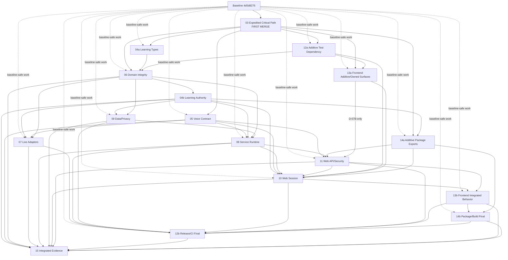

# Review Remediation Swarm Program Implementation Plan

> **For agentic workers:** REQUIRED SUB-SKILL: Use superpowers:subagent-driven-development (recommended) or superpowers:executing-plans to implement this plan task-by-task. Steps use checkbox (`- [ ]`) syntax for tracking.

**Goal:** Remediate every verified 2026-08-23 code-review finding through capability-owned worktrees, an expedited Critical lane, explicit contract handoffs, and one evidence-backed integration gate.

**Architecture:** One integration coordinator owns the program ledger and merge train. Twelve remediation lanes in Plans 03–14 own disjoint production surfaces; Plan 03 temporarily owns only the two Critical vertical slices and merges first, contract owners then publish stable interfaces, and dependent lanes rebase before contract-dependent work. Plan 15 verifies the already-integrated tree and owns final evidence. Parallel work is allowed from the reviewed baseline when it neither edits a reserved hotspot nor consumes an unfinished contract.

**Tech Stack:** Git worktrees, Bun/Turbo/TypeScript/React/Next.js, Rust/Tokio/Axum/SQLx/Postgres, Playwright, GitHub Actions, Railway, Cartesia, Gemini

**Spec:** `docs/superpowers/reviews/index.md`, `docs/superpowers/reviews/2026-08-23-comprehensive-review-summary.md`, and every Markdown file under `docs/superpowers/reviews/`

## Global Constraints

- Code-audit baseline is commit `4d5d8276f03635ca74c04f4d500d13ce62198dd0`; refresh external state before execution, but never silently move this audit baseline.
- `PROGRAM_BASE_SHA` is the first integration commit containing only the 21 review documents, this 15-plan suite, and the `/.worktrees/` ignore rule on top of the code-audit baseline. `LANE_BASE_SHA` is the later coordinator decision-registry snapshot descended from it, including the D-01 decision document when D-01 is answered. Every lane branches from `LANE_BASE_SHA`; both commits remain planning-only, so the code baseline is still `4d5d8276` and every plan plus recorded decision is available inside each worktree.
- Preserve unrelated dirty or untracked work. At plan-authoring time `.impeccable.md` and `docs/superpowers/reviews/` are untracked and belong to the user.
- Never implement a remediation directly on `main`. Use one isolated worktree per lane and one integration worktree.
- Bootstrap the integration worktree at the sibling path `/Users/connor/Medica/backbay/viva-review-remediation-integration`; do not create it under an unignored project-local directory. Before creating lane worktrees inside that integration checkout, add exactly `/.worktrees/` to its `.gitignore`, commit the planning suite, and verify the ignore rule.
- Plan 03 is the first merge. Before it merges, all other lanes may commit only baseline-safe work that neither touches a temporary Critical hotspot nor consumes a new contract.
- After plan 03 merges, every active lane rebases on the integration tip before touching a transferred hotspot or consuming protocol v5.
- Permanent file ownership is exclusive. A non-owner may read a hotspot, add a handoff request to its own plan/PR, and consume a published interface; it may not edit the hotspot.
- Plan 05 is the sole post-Critical owner of `agent/crates/agent-service/src/protocol.rs`, `packages/core/src/agent-contract.ts`, and `agent/fixtures/voice-protocol/**`.
- Plan 09 is the sole migration-number allocator and sole owner of `agent/migrations/**`.
- Plan 12 is the sole owner of `.github/workflows/validate.yml`.
- Plan 15 and the integration coordinator are the only writers of the central coverage ledger during execution.
- Critical and Important behavioral findings require a witnessed RED failure, minimal GREEN implementation, focused verification, and task review. A command or workflow contract may be the RED artifact for evidence-only findings.
- A row is classified as `TESTED_FIX`, `BATCH_FIX`, `DUPLICATE_ALIAS`, `DECISION_BLOCKED`, `EXTERNAL_EVIDENCE`, or `DEFERRED`. `EXTERNAL_EVIDENCE` means completion requires evidence from an environment not established by repository-local tests. Only behavioral/security/data/runtime Minors require a dedicated RED test.
- Critical and Important findings cannot be deferred. A deferred Minor retains its source alias, risk, owner, reason, and target milestone in the ledger.
- Tests must assert real behavior with hand-derived expectations. Do not use source grep as behavioral proof, mirror the implementation in the assertion, or assert only on mocks.
- Preserve fail-closed public-bind, authentication, authorization, deletion, replay, evidence-redaction, and provider-admission behavior.
- No real secret, learner answer text, raw provider payload, or session token may enter fixtures, logs, review artifacts, or evidence bundles.
- Local or isolated green output is not release evidence. The final status vocabulary is exactly `CODE_REMEDIATION_COMPLETE`, `CODE_COMPLETE_EXTERNAL_GATES_PENDING`, or `RELEASE_READY`.
- Required hosted, provider, Railway, microphone, browser, and assistive-technology checks may become `BLOCKED_EXTERNAL`; they never become `PASS` merely because credentials, billing, hardware, or administrator access are unavailable.
- Ordinary focused commits and PR references are sufficient. Do not require custom commit trailers or a second progress protocol that duplicates the ledger.

---

## 1. Audited Corpus and Completion Arithmetic

The implementation corpus is fixed at 21 review documents:

| Document class | Count |
| --- | ---: |
| Component reviews from the first review team | 12 |
| Parallel synthesis/area reviews | 8 |
| Comprehensive summary | 1 |
| **Total** | **21** |

The component finding-instance count is fixed at:

| Severity | Instances |
| --- | ---: |
| Critical | 2 |
| Important | 44 |
| Minor | 82 |
| **Total** | **128** |

The 128 number counts source finding instances, not unique patches. Duplicate source findings remain visible in the coverage ledger and point to one canonical remediation task. Synthesis aliases (`ARC-*`, `COR-*`, `SEC-*`, `REL-*`, `QLT-*`, `FE-*`) and unnumbered acceptance obligations are additional traceability rows; they do not inflate the verified 128 component total.

Program completion requires:

1. Every component finding instance has one ledger row.
2. Every synthesis alias and unnumbered obligation has a ledger row.
3. Every row names one canonical task, disposition, owner, proof, and status.
4. No Critical or Important row is `DEFERRED`.
5. Every `DECISION_BLOCKED` row names a decision below and remains visibly open until Connor records a branch.
6. The final combined SHA passes mandatory evidence Levels 1–3 in plan 15.

## 2. Plan Suite and Branch Names

| Plan | File | Branch | Purpose |
| --- | --- | --- | --- |
| 01 | `2026-08-23-review-remediation-swarm-program.md` | integration-owned (planning suite committed at `PROGRAM_BASE_SHA` on `review-remediation/integration`) | Program authority, ownership, DAG, execution rules |
| 02 | `2026-08-23-review-remediation-finding-coverage-ledger.md` | integration-owned | All findings, aliases, dispositions, proof, PR references |
| 03 | `2026-08-23-expedited-critical-path.md` | `review-remediation/03-critical-path` | Both Critical vertical slices; first merge |
| 04 | `2026-08-23-learning-core-authority.md` | `review-remediation/04-learning-core` | Scheduling, evaluation, recap, progression, read model |
| 05 | `2026-08-23-voice-wire-auth-contract.md` | `review-remediation/05-voice-contract` | Protocol v5, shared fixtures, token vectors, strict parsing |
| 06 | `2026-08-23-rust-domain-integrity.md` | `review-remediation/06-domain-integrity` | Domain state, failure types, purity, fail-closed ports |
| 07 | `2026-08-23-live-provider-adapters.md` | `review-remediation/07-live-adapters` | Cartesia/Gemini/STT/TTS/LLM behavior and transport |
| 08 | `2026-08-23-agent-service-runtime.md` | `review-remediation/08-service-runtime` | WebSocket liveness, admission, bounds, shutdown |
| 09 | `2026-08-23-persistence-postgres-privacy.md` | `review-remediation/09-data-privacy` | Postgres proof, idempotency, privacy, migrations, observe |
| 10 | `2026-08-23-web-session-audio.md` | `review-remediation/10-web-session` | Browser session/audio client and mounted session UI |
| 11 | `2026-08-23-web-api-security.md` | `review-remediation/11-web-api-security` | BFF/session routes, refresh, proxy bounds, distributed state |
| 12 | `2026-08-23-release-monitor-ci-supply-chain.md` | `review-remediation/12-release-ci` | Release scripts, monitors, CI, audits, supply chain |
| 13 | `2026-08-23-frontend-accessibility-performance.md` | `review-remediation/13-frontend` | General UI accessibility, tokens, fonts, performance |
| 14 | `2026-08-23-package-build-contracts.md` | `review-remediation/14-package-build` | Exports, paths, Turbo, static export, metadata |
| 15 | `2026-08-23-integrated-evidence-and-release-readiness.md` | `review-remediation/integration` (coordinator; no second lane) | Frozen tree, durable proof, external evidence, public docs |

The integration branch is `review-remediation/integration`. Lane PRs target it, never `main`. The final release PR is merged into `main` only after plan 15 records a terminal status; a draft PR targeting `main` may exist earlier solely as Plan 15's durable reconciliation anchor and is marked ready and merged only after that terminal status exists.

## 3. Product and Policy Decisions Reserved for Connor

Workers may write characterization tests, fixtures, and exact alternative branches before a decision. They may not write decision-dependent production GREEN code until the coordinator records Connor's selection in the coverage ledger.

| ID | Decision | Branch A | Branch B | Affected plans |
| --- | --- | --- | --- | --- |
| `D-01 SCHEDULING_AUTHORITY_EXAM` | Scheduling authority and exam margin | `SERVER_PERSISTED_FSRS`: persist `PersistedFsrsCardV1` and authoritative `ReviewScheduleDecisionV1` at outcome write time | `EVENTS_PLUS_READ_TIME_PROJECTION`: persist `ReviewHistoryEventV1`; derive `ReadTimeReviewProjectionV1` only while building the authenticated read model | 03, 04, 06, 08, 09, 10, 11, 13 |
| `D-02 QUESTION_PROGRESSION` | General-study question policy | Durable adaptive progression using outcomes/mastery | Deterministic ordered progression with retry/exhaustion; explicitly defer adaptation | 04, 06, 07, 09, 10 |
| `D-03 MODE_GOAL_CONTRACT` | Four modes and typed goal | Bind mode and optional goal into signed start/session authority and projection | Remove unsupported mode/free-text affordances; expose one honest `Begin oral exam` action backed by the existing canonical `quiz` engine and no goal | 04, 05, 06, 08, 10, 11, 13 |
| `D-04 DELETION_UX` | Destructive library actions | `CONFIRM_DELETE`: named inline/dialog confirmation for both study-set/source deletion and session-recap/history deletion, followed by permanent deletion | `SOFT_DELETE_UNDO`: authoritative 30-second server undo for study-set/source deletion; session-recap/history deletion still requires named confirmation because no recap-restore contract exists | 06, 08, 09, 11, 13 |
| `D-05 DATA_RETENTION` | Study-set/session deletion semantics | Hard-purge learner-authored/derived text; retain only content-free tombstones needed for idempotence/audit | Indefinitely retain only generated concept fields `public_id`/`label`/`status` and inactive generated-question fields `question_id`/`prompt`/`expected_terms`/`follow_up`, exclude them from learner projections/exports, and provide no administrative purge | 09, 11, 15 |
| `D-06 STATIC_EXPORT` | Undocumented static-export mode | Retain only with a named consumer, deterministic build/cache contract, and browser gate | Delete every flag, routing branch, test, and public claim | 05, 10, 11, 12, 13, 14, 15 |
| `D-07 TOKEN_ONLY_REFRESH` | Token-only public deployment and refresh | Retain with pre-upgrade verification plus separate rotating one-time hashed refresh credential and absolute lifetime | Remove token-only mode; require shared bearer or service-authenticated deployment | 05, 08, 10, 11, 13, 14, 15 |
| `D-08 DISCLOSURE_SCOPE` | Learner-content disclosure | Require acknowledgment for both live typed and microphone content | Scope copy and gate to microphone audio only | 10, 13, 15 |
| `D-09 STRUCTURED_PREVIEW_EVIDENCE` | Release meaning of structured preview | Exercise a real product pending/extraction state and bind it to proof | Exempt/remove it from required frames and report it separately as non-product evidence | 12, 15 |

The branch label alone is not a complete decision record when the selected branch contains a product parameter or named external owner:

- `D-01` must also record the exact exam-margin rule, including its numeric duration and calendar/time-zone interpretation. Workers may not invent either value.
- `D-06A` must name the actual static deployment consumer and the separate server BFF that owns Plan 11's API routes.
- `D-07B` must name the trusted replacement service owner and freeze its same-origin gateway endpoint, request/session-auth contract, and deployment boundary.

Exam cap/margin is part of `D-01`; neither branch may display a future-exam review after the exam once the selected margin is applied. Unwritten database columns are not a product decision: plan 09 removes each proven-unwritten column unless an already-approved typed writer and durable tests exist before the schema task begins.

If `D-04` selects `SOFT_DELETE_UNDO`, the study-set/source cross-lane contract is fixed rather than worker-designed. Plan 09 persists `SoftDeleteReceiptV1` with `deletion_id`, `study_set_id`, database-authored `deleted_at`, `undo_expires_at`, and policy `soft_delete_undo`; restore is legal only while `database_now < undo_expires_at`. Plan 08 exposes `POST /v1/study-sets/{study_set_id}/restore` with exact JSON body `{ "deletion_id": "..." }` and returns the exact typed `RestoreStudySetOutcomeV1` for `Restored` or `AlreadyRestored`. Plan 11 exposes same-origin `POST /api/viva-library/{study_set_id}/restore`, consumes a one-time BFF-minted `library_restore` control capability from `X-Viva-Control-Token`, forwards only `{ "deletion_id": "..." }` plus a fresh `X-Viva-Verified-User-Id` derived exclusively from the verified capability, and authenticates that server-built header with `VIVA_AGENT_LIBRARY_DELETE_BEARER_TOKEN`. Plan 08 accepts the identity header only with that exact service bearer and derives Plan 09's internal tuple from header, path, and body; no browser-supplied identity is forwarded or trusted. Plan 11 validates/forwards only the typed success. Plan 13 keeps the capability in memory only and never restores a client-cached row before the authoritative response. Session-recap/history deletion remains permanent under this branch and therefore uses the same named confirmation matrix as `CONFIRM_DELETE`. `CONFIRM_DELETE` registers no restore route and mints no restore capability.

## 4. Exclusive Ownership Table

Tests adjacent to a production surface follow that surface's owner unless the table assigns a shared fixture explicitly.

| Surface | Plan 03 temporary scope | Permanent owner | Non-owner rule |
| --- | --- | --- | --- |
| `agent/crates/agent-domain/src/tool_executor.rs` | Fixed-date Critical only | Plan 04 | Plans 06/07/09 consume interfaces; no edits |
| `packages/core/src/scheduling.ts` | Fixed-date Critical only | Plan 04 | Plans 10/13 render projections only |
| `packages/core/src/learner-loop-contract.{ts,json}` | None | Plan 04 | Raw scripts validate published artifact |
| `packages/core/src/study-projection-contract.ts` | None | Plan 04 | Plans 09/11 implement; plan 10 consumes |
| `packages/core/src/learner-recovery-copy.ts` | None | Plan 04 | Consumers import generated copy only |
| `agent/fixtures/learning-core/**` | Scheduling Critical fixtures only | Plan 04 | Plans 07/09/10 read-only |
| `agent/crates/agent-service/src/protocol.rs` | Protocol-v5 audio lifecycle only | Plan 05 | Plans 07/08 consume events/fixtures |
| `packages/core/src/agent-contract.ts` | Protocol-v5 audio lifecycle only | Plan 05 | Plans 10/11 consume parsers/types |
| `agent/fixtures/voice-protocol/**` | Protocol-v5 Critical fixtures only | Plan 05 | Plans 07/08/10 read-only |
| `agent/fixtures/session-token/**` | None | Plan 05 | Plans 08/11 read-only |
| `agent/crates/agent-service/src/lib.rs` | None | Plan 08, after Plan 05 removes the obsolete `ReadyFrame` re-export | Plan 05's one pre-handoff removal is the only exception |
| `agent/crates/agent-domain/src/{study,tools,tool_executor}.rs` and Plan-04-created learning modules | Selected D-01 scheduling slice only | Plan 04 | Plan 06 supplies failure/port/export integration through its own files |
| `agent/crates/agent-domain/src/brain.rs`, Plan-06-created `session_state.rs`/conditional `deletion.rs`, and `tests/protocol_fixtures.rs` | None | Plan 06 | Plans 04/09 send exact type/port handoffs; these files never have temporary Plan 03 ownership |
| `agent/crates/agent-domain/src/{review_schedule,review_history}.rs` | Selected D-01 branch only | Plan 04 | Plan 04 extends the selected seam; no competing domain type |
| `agent/crates/agent-domain/src/{lib,ports}.rs`, `agent/crates/agent-domain/Cargo.toml`, and scheduling conformance test export | Selected D-01 port/export/dependency slice only | Plan 06 | Plan 04 sends behavior/type handoffs; Plan 06 owns exports and port integration after the first merge |
| `agent/crates/agent-adapters/src/cartesia_gemini/runner.rs` | Protocol-v5 streaming Critical only | Plan 07 | No service/web edits |
| `agent/crates/agent-adapters/src/synthetic.rs` | Fixed-date Critical only | Plan 07 | No learning-core edits after handoff |
| Other `agent/crates/agent-adapters/**` | None | Plan 07 | Contract/port changes requested from owner |
| `agent/crates/agent-service/src/ws.rs` | Protocol-v5 receive/end-turn Critical only | Plan 08 | Backend parity requests arrive as interfaces |
| `agent/crates/agent-service/src/{app,main,config,lib}.rs` | Selected D-01B projection route in `app.rs` only | Plan 08 | `protocol.rs` remains Plan 05; Plan 08 rebases on the Branch-B read seam instead of recreating it |
| `agent/crates/agent-service/Cargo.toml` | None | Plan 08 | Service may add test-only features here |
| `agent/crates/data/src/{postgres,memory,migrations}.rs` | Selected D-01 persistence slice only | Plan 09 | Plan 09 rebases on and extends, never recreates, the selected Plan 03 v1 seam |
| `agent/crates/data/src/lib.rs` and D-01-focused data tests | Selected D-01 persistence/export slice only | Plan 09 | Plan 09 owns all post-Critical data exports and conformance |
| `agent/migrations/**` | Selected D-01 initial v1 migration only | Plan 09 | Plan 03 records its allocated number; Plan 09 is sole allocator after that first merge |
| `agent/crates/observe/**` | None | Plan 09 | Service consumes sanitized values |
| `apps/web/components/session/LiveSessionPage.tsx` | Streaming-turn Critical only | Plan 10 | Plan 13 sends UI handoffs, not edits |
| `apps/web/lib/viva-agent-client.ts` | Protocol-v5 streaming Critical only | Plan 10 | Plan 05 owns wire types |
| `apps/web/lib/use-viva-agent-session.ts` | Protocol-v5 retained-turn/session-hook Critical only | Plan 10 | Plan 10 owns post-Critical session orchestration |
| `apps/web/lib/viva-audio-{capture,playback}.ts` | Streaming/resampling Critical only | Plan 10 | Adapter resampling is a separate explicit seam |
| `apps/web/app/api/viva-session/shared.ts` | None | Plan 11 | Plan 05 owns token fixtures; Plan 08 owns Rust admission |
| `apps/web/app/api/viva-*/**` | Selected D-01B projection proxy only | Plan 11 | Plan 11 rebases on the Branch-B read seam; UI owners consume APIs |
| `apps/web/proxy.ts` and `apps/web/lib/viva-security-headers.test.ts` | None | Plan 11 | Plan 14 owns `next.config.ts`; UI/build lanes consume the CSP/header contract, no edits |
| `.github/workflows/validate.yml` | None | Plan 12 | Other lanes provide command/gate handoffs |
| `scripts/*release*`, `scripts/*monitor*`, `scripts/*e2e*` | New Critical audio E2E harness only | Plan 12 | Contract owners publish validated inputs; Plan 15's `integration-readiness`/`public-contract` scripts are separate named surfaces |
| `scripts/fixtures/e2e-browser-audio-entry.ts` | New Critical audio E2E fixture only | Plan 12 | Plan 12 owns its post-Critical release/E2E integration |
| Release Dockerfiles/provenance/lockfile audit integration | None | Plan 12 | Capability source remains read-only |
| `apps/web/app/globals.css` | None | Plan 13 | Plan 10 never changes global styling |
| `packages/tokens/**`, `packages/ui-web/**` | None | Plan 13 | Plan 14 records package handoffs; Plan 13 owns both package manifests |
| General landing/library UI, `apps/web/lib/viva-library.ts`, and `apps/web/app/page.tsx` | Selected D-01B read projection in `viva-library.ts` only | Plan 13 | Session page remains Plan 10; Plan 13 rebases on the Branch-B projection seam |
| `packages/core/package.json`, root export surface in `packages/core/src/index.ts` | None | Plan 14 | Behavioral core modules remain Plans 04/05 |
| Root `package.json` and `apps/web/package.json` | Critical-audio script entries only (one script file; two invoking entries `e2e:browser:audio` and `e2e:browser:audio:negative`) | Plan 12 | Plans 10/13/14 send exact dependency/script handoffs; Plan 12 may use early additive dependency/manifest commits and a later rebased release-integration commit |
| `bun.lock` and `agent/Cargo.lock` | Selected D-01 dependency only | Plan 12 | Plan 03 may update only its explicitly temporary Critical slice before the Plan 12 handoff |
| `tsconfig.base.json`, `turbo.json`, `apps/web/next.config.ts` | None | Plan 14 | Workflow remains Plan 12 |
| `agent/Cargo.toml` workspace metadata | None | Plan 14 | Domain dependency policy changes require Plan 06 handoff |
| `docs/deployment-runbook.md` | None | Plan 12 for release-mechanism edits, then Plan 15 for final reconciliation | Plan 15 rebases after Plan 12 and is the final writer |
| `docs/decisions/2026-08-23-d-01-review-scheduling-authority.md` | None | Integration coordinator | Plan 03 and every scheduling consumer read the coordinator-recorded Connor decision; lanes never rewrite it |
| `README.md`, `CONTRIBUTING.md`, governance/requirements docs, and final public contract | None | Plan 15 | Capability lanes submit documentation facts and acceptance tests, not edits |
| `scripts/integration-readiness.*`, `scripts/public-contract.*`, and `docs/release-readiness.md` | None | Plan 15 | These named integration surfaces are outside Plan 12's release-script glob |

When an additive contract must land before consumers migrate, the owner uses two integration PRs from the same lane: an additive compatibility PR, followed by consumer-owner migrations, followed by the owner's removal PR. The fixture-only core export split uses this pattern so the combined integration tip is never left permanently red. Under the coordinator-authorized D-01 split of Plan 03 (Plan 03 Task 0), PR `03-audio` satisfies the "Plan 03 is the first merge" constraint for the audio seams, and every scheduling hotspot stays frozen for all lanes until PR `03-scheduling` merges.

## 5. Protocol-v5 Critical Handoff

Plan 03 publishes protocol v5 with these non-negotiable values:

```text
audio encoding: pcm_s16le
channels: 1
sample rate: 24_000 Hz
audio_chunk maximum: 4_096 samples / 8_192 raw bytes
audio turn maximum: 1_080_000 samples / 2_160_000 raw bytes / 45 seconds
text frame maximum: 65_536 bytes (unchanged)
```

`audio_chunk` contains `client_generation_id`, `turn_id`, monotonically increasing `sequence`, and base64 PCM. `audio_end` contains the same generation/turn identity and the final sequence. The server rejects gaps, duplicates, out-of-order chunks, identity changes, over-cap chunks, and over-cap turns without submitting a phantom provider turn. Tests exercise 2-, 10-, and 45-second turns, 44.1/48 kHz capture, backpressure, cancellation, and a negative control reproducing the pre-v5 single-frame failure.

After the first merge, plan 05 owns v5, exact fixtures, canonical token vectors, and legacy-v4 disposition. Plans 07, 08, and 10 consume the contract; they do not fork it.

## 6. Merge DAG

All worktrees may start from the baseline. Dotted work is local-only until prerequisites merge; solid edges are merge dependencies.



`04a` contains the Plan-04-owned decision-neutral learning type surface — the new `learning_outcome.rs`, `learning_recap.rs`, `learning_progression.rs`, and `study_projection.rs` modules (landing unregistered until Plan 06's `lib.rs` integration), the additive `study.rs`/`tools.rs` type extensions that reference only already-registered types (extensions referencing the unregistered learning modules ride in `04b`, per Plan 04's Integration nodes section), and the shared `agent/fixtures/learning-core/*.json` fixtures; `tool_executor.rs` changes and `tests/learning_core.rs` ride only in `04b`. Plan 06 then lands the `brain.rs`/`ports.rs`/`lib.rs` integration; `04b` lands the executor and complete learning authority. `12a` comprises Plan 12's early additive manifest/lock commits: the exact `happy-dom@20.11.6` plus `@happy-dom/global-registrator@20.11.6` handoff needed by Plans 10/13, the root `yaml: "2.8.2"` dev dependency needed by Plan 06's workflow/domain policy test, the root `"@viva/core": "workspace:*"` dev dependency plus `build:cache:prove` script needed by Plan 14's GREEN verification (each with its regenerated `bun.lock`), and the lockfile-regeneration commit for Plan 13's Task 1/2 package-manifest handoff that must exist before `13a` merges and is admitted to integration only immediately before `13a`, with no intervening lane merge; all other Plan 12 work may continue locally, but `12b` is the only final release/workflow merge. `13a` publishes effects policy, token/UI package manifests and CSS surfaces, the selected D-07 frontend prerequisite, and other additive owner-local work needed by Plans 10/11; `13b` lands the selected D-06 frontend surface, deletion UI, and remaining frontend behavior after the service/BFF/session consumers exist. `14a` adds fixture/package exports without removing the old root surface; consumers migrate their imports; `14a` merges only after Plan 04's `04b` commits publishing the `study-projection-contract.ts` module (LEARN-008) and the LEARN-006A `VIVA_LEARNER_LOOP_TERMINAL_REASONS` export are on integration, since its `runtime-validation.ts` and study-projection root re-exports consume them (the `L04B --> L14A` edge), and Plan 11's root `@viva/core` import form in turn requires merged `14a` (the `L14A --> L11` edge); `14b` removes the old surface and lands the selected D-06/build contract. If Plan 05 exercises its sanctioned two-PR split (Tasks 1–6 first, Tasks 7–9 second), the second PR carries a solid `L06 --> L05` merge dependency and is admitted only after Plan 06's `BrainEvent::TurnDeferred` merge. These split nodes are commits/PRs from the same lane worktree, not extra owners or permanent branches. Lane-level cross-product verification must not create a reverse dependency on a later node; an owner-scoped post-integration verification pass (for example Plan 06 Task 8 or Plan 04's LEARN-011/LEARN-012) may run as a supplement after its consumers merge, but it never replaces or front-runs the frozen combined checks, which belong to Plan 15.

## 7. Stigmergic Execution Signals That Remain

The swarm coordinates through durable repository facts, not chat history:

1. The program document defines authority and edges.
2. Each lane plan defines exact tasks, interfaces, commands, and handoffs.
3. Each lane has one worktree and one branch.
4. The coverage ledger has one coordinator writer and stores canonical status plus PR/evidence references.
5. Published contract commits and the integration tip tell dependent lanes when to rebase.
6. PR reviews and test reports remain with their PRs; the ledger links rather than duplicates them.

There are no mandatory custom commit trailers, no shared worker-edited progress file, and no second coordination protocol.

## 8. Evidence Ladder and Truthful Terminal States

| Level | Requirement | Mandatory for code completion | Missing-state treatment |
| --- | --- | --- | --- |
| 1 | Lane-focused RED/GREEN, lint/type/build/security checks | Yes | Lane remains open |
| 2 | One frozen combined SHA: forced TS/Rust/browser/WS/release checks | Yes | Program remains open |
| 3 | Real disposable Postgres: full suite twice, migration/restart/concurrency/deletion proof | Yes | Program remains open; missing `DATABASE_URL` is not a skip |
| 4 | Hosted exact-SHA CI and GitHub protection/rulesets | Required for `RELEASE_READY` | `BLOCKED_EXTERNAL` with run/owner/reason |
| 5 | Real provider/Railway/deploy/microphone/cross-browser/a11y | Required where release scope claims them | `BLOCKED_EXTERNAL` with owner/reason |

Terminal meanings:

- `CODE_REMEDIATION_COMPLETE`: all source findings are resolved or deferred under policy and Levels 1–3 pass, but the required external set contains a recorded `FAIL` or otherwise qualifies for neither clean external-pending status nor `RELEASE_READY`; code remediation is complete, the release claim is not, and the external remediation loop remains open.
- `CODE_COMPLETE_EXTERNAL_GATES_PENDING`: all source findings are resolved or deferred under policy and Levels 1–3 pass, no required Level 4–5 gate is `FAIL`, and at least one required external gate is `BLOCKED_EXTERNAL` with its accountable owner, attempted evidence, reason, and required state change recorded.
- `RELEASE_READY`: Levels 1–5 required for the selected release scope pass on exact bound revisions, and branch-protection/release-owner tasks are complete.

Plan 15 deliberately requires all six `OPS-01`–`OPS-06` gates for `RELEASE_READY` regardless of release scope; that is a recorded tightening of the "required for the selected release scope" language above, and narrowing release scope must arrive as a coordinator-recorded amendment to this program from Connor, never as a worker-local relaxation.

## 9. Human and Operations Tasks

| ID | Owner role | Required action |
| --- | --- | --- |
| `OPS-01` | GitHub billing owner | Clear Actions billing/account restrictions and authorize exact-SHA workflow execution |
| `OPS-02` | GitHub administrator | Configure required checks, branch protection/rulesets, administrator enforcement, and break-glass policy |
| `OPS-03` | Railway operator | Provide project access and bind evidence to deployed service revision |
| `OPS-04` | Provider-secret owner | Supply Cartesia/Gemini credentials and confirm required ZDR configuration |
| `OPS-05` | Device/accessibility operator | Execute the chosen microphone, browser, and assistive-technology matrix |
| `OPS-06` | Release owner | Decide whether external blockers permit only code closure or an actual release |

## 10. Coordinator Task Sequence

### Task 1: Freeze the Program Baseline and Safe Worktree Root

**Files:**
- Modify if needed: `.gitignore`
- Read: `docs/superpowers/plans/2026-08-23-review-remediation-swarm-program.md`
- Read: `docs/superpowers/plans/2026-08-23-review-remediation-finding-coverage-ledger.md`

**Interfaces:**
- Consumes: reviewed baseline `4d5d8276f03635ca74c04f4d500d13ce62198dd0`
- Produces: integration branch, planning-only `PROGRAM_BASE_SHA`, ignored lane-worktree root, recorded live external-state snapshot

- [ ] **Step 1: Verify the baseline and preserve dirty work**

Run:

```bash
git rev-parse HEAD
git status --short --branch
git diff -- . ':!docs/superpowers/plans'
```

Expected: HEAD is `4d5d8276f03635ca74c04f4d500d13ce62198dd0`; unrelated changes are recorded and left untouched.

- [ ] **Step 2: Bootstrap the integration worktree outside the checkout**

Run:

```bash
git worktree add /Users/connor/Medica/backbay/viva-review-remediation-integration \
  -b review-remediation/integration \
  4d5d8276f03635ca74c04f4d500d13ce62198dd0
```

Expected: a clean sibling worktree on `review-remediation/integration`. This avoids putting a worktree inside the currently unignored `.worktrees/` path.

- [ ] **Step 3: Copy only the approved review and plan artifacts into the integration worktree**

Run from the original `/Users/connor/Medica/backbay/viva` checkout:

```bash
cp -R docs/superpowers/reviews \
  /Users/connor/Medica/backbay/viva-review-remediation-integration/docs/superpowers/
cp docs/superpowers/plans/2026-08-23-*.md \
  /Users/connor/Medica/backbay/viva-review-remediation-integration/docs/superpowers/plans/
```

Expected: the 21 reviews and exactly this 15-plan suite are present. Existing tracked historical plans remain untouched.

- [ ] **Step 4: Add and verify the local worktree ignore rule**

In the integration worktree, use `apply_patch` to append exactly:

```gitignore
/.worktrees/
```

Then run:

```bash
cd /Users/connor/Medica/backbay/viva-review-remediation-integration
git check-ignore -q --no-index .worktrees/probe
```

Expected: exit 0.

- [ ] **Step 5: Commit the planning-only program base**

```bash
git add .gitignore docs/superpowers/reviews docs/superpowers/plans/2026-08-23-*.md
git diff --cached --check
git commit -m "docs: define review remediation program"
PROGRAM_BASE_SHA="$(git rev-parse HEAD)"
changed_paths="$(git diff --name-only 4d5d8276f03635ca74c04f4d500d13ce62198dd0 "${PROGRAM_BASE_SHA}")"
unexpected_paths="$(printf '%s\n' "${changed_paths}" | awk '
  !/^(\.gitignore|docs\/superpowers\/reviews\/|docs\/superpowers\/plans\/2026-08-23-)/
')"
test -z "${unexpected_paths}"
```

Expected: the final command exits 0, proving no product code changed between the audit baseline and `PROGRAM_BASE_SHA`.

- [ ] **Step 6: Record current external state without changing it**

Run:

```bash
gh run list --branch main --limit 5 --json databaseId,status,conclusion,headSha,url,createdAt,workflowName
gh api repos/{owner}/{repo}/rulesets

protection_body="$(mktemp)"
protection_error="$(mktemp)"
if gh api repos/{owner}/{repo}/branches/main/protection >"${protection_body}" 2>"${protection_error}"; then
  cat "${protection_body}"
elif rg -q 'HTTP 404|Not Found' "${protection_error}"; then
  printf '%s\n' 'UNPROTECTED: GitHub branch-protection API returned 404'
else
  cat "${protection_error}" >&2
  exit 1
fi
```

Expected at plan authoring: run `31401218406` is failed on the baseline, branch protection returns 404, rulesets are empty. Any authentication, authorization, transport, or unexpected API error remains fatal. If state changed, record the fresh result; do not rewrite historical review claims.

### Task 2: Resolve Decision Gates and Initialize the Coordinator Ledger

**Files:**
- Modify: `docs/superpowers/plans/2026-08-23-review-remediation-finding-coverage-ledger.md`
- Create when D-01 is answered: `docs/decisions/2026-08-23-d-01-review-scheduling-authority.md`

**Interfaces:**
- Consumes: decisions `D-01` through `D-09`
- Produces: selected decision branches or explicit `DECISION_BLOCKED` rows, plus planning-only `LANE_BASE_SHA`; no worker-local decision substitutes

- [ ] **Step 1: Ask Connor only for unresolved product/policy decisions**

Present the exact A/B branches from Section 3. Do not ask workers to interpret prose or choose a default.

- [ ] **Step 2: Record each answer once in the coordinator decision registry**

Use this schema:

```markdown
| Decision | Selected branch | Decided by | Date | Consequences |
| `D-01 SCHEDULING_AUTHORITY_EXAM` | `SERVER_PERSISTED_FSRS` | Connor | 2026-08-23 | Plans 03/04/09/10 execute Branch A; exact exam-margin duration and calendar/time-zone rule are linked in the coordinator-owned decision document |
```

If unanswered, retain `DECISION_BLOCKED` and allow only decision-independent work.

The canonical recording act for a decision is replacing the `Current state` cell of the matching row in the ledger's coordinator decision registry in place with the exact selected branch selector; the recording row above is an optional provenance appendix that must repeat the same selector and never introduces a second variant. Plan 06's Task 1A/3A checkpoints and Plan 12's Task 18 parse these recorded forms and hard-stop (exit 64) on zero or conflicting matches.

When D-01 is answered, create `docs/decisions/2026-08-23-d-01-review-scheduling-authority.md` from Connor's exact values. It must contain the selected enum, FSRS parameter/policy version, status-to-rating mapping, numeric exam-margin duration, calendar/time-zone rule, past-exam behavior, schema/version ownership, rollback behavior, and the reference oracle — name, release version, and artifact-digest source — for the independent conformance fixture; when Branch A is selected it must also record the exact Rust FSRS crate name and pinned version. Write these as exactly the line format Plan 03 Task 0 Step 4 verifies: one line `` Selected authority: `SERVER_PERSISTED_FSRS` `` or `` Selected authority: `EVENTS_PLUS_READ_TIME_PROJECTION` ``, eight lines beginning exactly `FSRS policy version:`, `Status-to-rating mapping:`, `UTC rule:`, `Exam margin:`, `Past-exam rule:`, `Schema owner:`, `Rollback:`, and `Reference oracle:`, a line beginning exactly `Rust FSRS crate:` when Branch A is selected, plus a rejected-branch section describing the unselected branch. The D-01 ledger row links to that file; Plan 03 verifies it byte-for-byte, fails closed on any missing line, and never authors a missing value.

- [ ] **Step 3: Verify ledger arithmetic**

Run the ledger's mechanical counting command. Expected: 21 source documents, 128 component rows, 2 Critical, 44 Important, 82 Minor, with synthesis/obligation rows reported separately. The command is the fenced block in the "Mechanical counting command" subsection of the ledger's Mechanical corpus reconciliation section.

- [ ] **Step 4: Commit the decision snapshot**

```bash
git add docs/superpowers/plans/2026-08-23-review-remediation-finding-coverage-ledger.md
if test -f docs/decisions/2026-08-23-d-01-review-scheduling-authority.md; then
  git add docs/decisions/2026-08-23-d-01-review-scheduling-authority.md
fi
git commit -m "docs: initialize remediation decisions and coverage"
LANE_BASE_SHA="$(git rev-parse HEAD)"
git merge-base --is-ancestor "${PROGRAM_BASE_SHA}" "${LANE_BASE_SHA}"
test -z "$(git diff --name-only 4d5d8276f03635ca74c04f4d500d13ce62198dd0 "${LANE_BASE_SHA}" | awk '
  !/^(\.gitignore|docs\/decisions\/2026-08-23-d-01-review-scheduling-authority\.md|docs\/superpowers\/reviews\/|docs\/superpowers\/plans\/2026-08-23-)/
')"
```

Expected: `LANE_BASE_SHA` is a planning-only descendant of the recorded `PROGRAM_BASE_SHA`; the final command exits 0.

### Task 3: Create All Lane Worktrees Without Serializing Baseline-Safe Work

**Files:**
- Read: plan files 03 through 14

**Interfaces:**
- Consumes: recorded `PROGRAM_BASE_SHA`, `LANE_BASE_SHA`, and ownership table
- Produces: one worktree per lane, each with an SDD ledger scoped to its own plan

- [ ] **Step 1: Create branches from the reviewed baseline**

Run this exact loop from `/Users/connor/Medica/backbay/viva-review-remediation-integration`. Resolve both named commits rather than overwriting `PROGRAM_BASE_SHA`:

```bash
PROGRAM_BASE_SHA="$(git log --format=%H --fixed-strings --grep='docs: define review remediation program' -n 1)"
LANE_BASE_SHA="$(git rev-parse HEAD)"
git merge-base --is-ancestor "${PROGRAM_BASE_SHA}" "${LANE_BASE_SHA}"

while IFS='|' read -r directory branch; do
  git worktree add ".worktrees/${directory}" -b "${branch}" "${LANE_BASE_SHA}"
done <<'LANES'
03-critical-path|review-remediation/03-critical-path
04-learning-core|review-remediation/04-learning-core
05-voice-contract|review-remediation/05-voice-contract
06-domain-integrity|review-remediation/06-domain-integrity
07-live-adapters|review-remediation/07-live-adapters
08-service-runtime|review-remediation/08-service-runtime
09-data-privacy|review-remediation/09-data-privacy
10-web-session|review-remediation/10-web-session
11-web-api-security|review-remediation/11-web-api-security
12-release-ci|review-remediation/12-release-ci
13-frontend|review-remediation/13-frontend
14-package-build|review-remediation/14-package-build
LANES
```

Expected: no branch starts from another lane's unreviewed head; every lane contains its plan and the unchanged audited product code.

- [ ] **Step 2: Run setup and baseline checks in each worktree**

```bash
bun install --frozen-lockfile
bun run validate
```

For Rust-only lanes, additionally run the lane's package tests from its plan. Record baseline failures rather than attributing them to remediation.

- [ ] **Step 3: Initialize one SDD workspace per plan**

Use the installed Superpowers `sdd-workspace` helper when available. For plan 03, the first ledger line is:

```markdown
# SDD ledger — plan: docs/superpowers/plans/2026-08-23-expedited-critical-path.md
```

For plans 04–14, substitute the exact plan filename from Section 2. No lane reads or writes another lane's SDD workspace.

### Task 4: Merge Plan 03 Before Any Other Lane

**Files:**
- Read: `docs/superpowers/plans/2026-08-23-expedited-critical-path.md`

**Interfaces:**
- Consumes: selected `D-01` branch
- Produces: protocol v5 audio lifecycle, removal of fixed dates, transfer commit recorded in the ledger

- [ ] **Step 1: Execute every Plan 03 Critical task using SDD**

Expected: dedicated RED/GREEN evidence for both Criticals and a clean task review after each.

- [ ] **Step 2: Run the Plan 03 frozen vertical-slice gate**

Run exactly the commands in plan 03, including production-shaped 2/10/45-second microphone-to-real-WebSocket tests and future-relative schedule persistence tests.

- [ ] **Step 3: Obtain a whole-branch review**

Critical or Important review findings must be fixed and re-reviewed. No Critical finding may be parked or deferred.

- [ ] **Step 4: Merge Plan 03 to integration first**

Record PR URL, merge commit, protocol version, scheduling branch, test commands, and review result in the central ledger. Record the merge commit in the ledger's Integration merge record as the literal line `Plan 03 merge SHA: <40-hex>` — Plan 04's LEARN-000 Step 1 parses exactly that format with no fallback. Under the coordinator-authorized Plan 03 two-PR split, PR `03-audio` is the first merge for the audio seams and PR `03-scheduling` is recorded the same way when it merges.

- [ ] **Step 5: Rebase all active lanes**

Each lane runs:

```bash
git fetch --all --prune
git rebase review-remediation/integration
```

Expected: transferred hotspots now have their permanent owner; no lane retains a competing pre-v5 implementation.

### Task 5: Merge Contract and Capability Lanes by the DAG

**Files:**
- Read: plans 04 through 14
- Modify: coverage ledger, coordinator only

**Interfaces:**
- Consumes: reviewed lane PRs and published interfaces
- Produces: one integration tip containing all canonical remediations

- [ ] **Step 1: Admit a lane PR only when its prerequisites are merged**

Use the solid edges in Section 6. Baseline-safe commits may exist earlier but do not waive rebase or contract checks.

- [ ] **Step 2: Check exclusive ownership before every merge**

Run:

```bash
git diff --name-only review-remediation/integration...HEAD
```

Expected: every changed hotspot is owned by that lane. Reject and reroute non-owner edits.

- [ ] **Step 3: Check task review and proof**

Require the lane's focused commands, SDD task-review result, final whole-branch review, and finding IDs. Do not accept a worker summary without diff/evidence.

- [ ] **Step 4: Merge and immediately run the consumer-facing focused gate**

After conflict resolution, re-run the lane's focused test command on the actual integration tip. A previously green worktree does not prove the resolved merge.

- [ ] **Step 5: Update the central ledger once**

Record canonical task status, PR URL, integration commit, proof reference, and any Minor disposition. Workers never update these fields themselves.

### Task 6: Execute Plan 15 on a Frozen Combined SHA

**Files:**
- Read: `docs/superpowers/plans/2026-08-23-integrated-evidence-and-release-readiness.md`
- Modify: final public documentation and central ledger, Plan 15 only

**Interfaces:**
- Consumes: completed plans 03 through 14
- Produces: `CODE_REMEDIATION_COMPLETE`, `CODE_COMPLETE_EXTERNAL_GATES_PENDING`, or `RELEASE_READY`

- [ ] **Step 1: Freeze and record the integration SHA**

```bash
git rev-parse HEAD
git status --short
```

Expected: one exact SHA and a clean tracked tree before validation.

- [ ] **Step 2: Run mandatory Levels 1–3**

Use plan 15's exact commands. Postgres must be real and disposable; run its durable suite twice.

- [ ] **Step 3: Reconcile all 128 rows and aliases**

Expected: no missing row, no unresolved Critical/Important, and every Minor explicitly fixed, duplicated, decision-blocked, or deferred under policy.

- [ ] **Step 4: Attempt Levels 4–5 and record external truth**

For every unavailable gate, record `BLOCKED_EXTERNAL`, owner, attempted command/URL, last state, and required external change. Do not replace execution with an attestation banner.

- [ ] **Step 5: Request independent whole-program review**

The reviewer receives the combined diff, all plan paths, the coverage ledger, evidence manifest, and exact SHA. Fix Critical/Important findings in one owner-routed wave and re-review the fix diff.

- [ ] **Step 6: Assign the truthful terminal state**

Use only the definitions in Section 8. `RELEASE_READY` is impossible while required hosted/live/admin gates remain `BLOCKED_EXTERNAL`.

## 11. Program Self-Review Checklist

- [ ] All 15 approved filenames exist.
- [ ] Every plan uses the required Superpowers header and checkbox tasks.
- [ ] The ownership table and every lane's Files section agree.
- [ ] Plan 03 is the first merge and owns only the two Critical slices.
- [ ] `tool_executor.rs` has one post-Critical owner: plan 04.
- [ ] `protocol.rs`, `agent-contract.ts`, and voice fixtures have one post-Critical owner: plan 05.
- [ ] `runner.rs`, `ws.rs`, `postgres.rs`, `LiveSessionPage.tsx`, `viva-agent-client.ts`, `shared.ts`, and `validate.yml` each have one permanent owner.
- [ ] All decision IDs are exactly `D-01` through `D-09` as defined here.
- [ ] Every contract consumer names its producer and exact interface/fixture path.
- [ ] No plan claims hosted/live/deployment evidence from local green output.
- [ ] No plan contains unresolved placeholder markers, cross-task shorthand, or an unbounded test-writing instruction.
- [ ] Critical/Important tasks have witnessed RED/GREEN steps; nonbehavioral Minor batches have focused verification without ceremonial tests.
- [ ] Final evidence distinguishes mandatory code completion from conditional release readiness.
